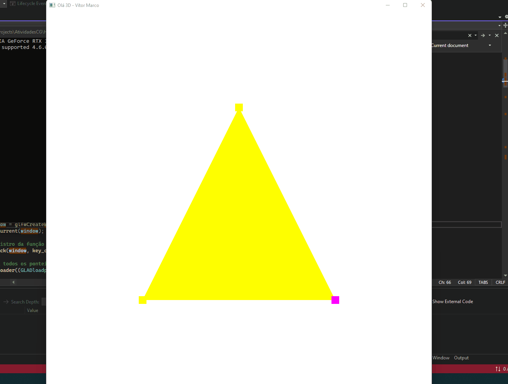
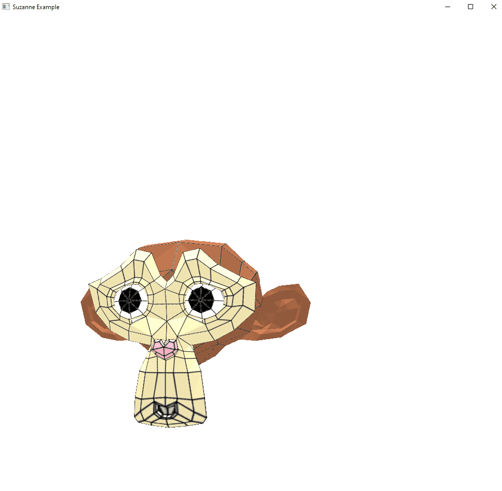

## Resultado M1

> [source M1](https://github.com/vitormarco/AtividadesCG/blob/main/Hello3D%20-%20withShaderClass/Exericio8/Origem.cpp)

## Resultado M2

> [source m2](https://github.com/vitormarco/AtividadesCG/blob/main/M2/Exericio8/Origem.cpp)

## Resultado Vivencial 1

> [Source vivencial 1](https://github.com/vitormarco/AtividadesCG/blob/main/vivencial_1/Exericio8/Origem.cpp)

## Resultado M3

> [Source M3](https://github.com/vitormarco/AtividadesCG/blob/main/M3/Exericio8/Origem.cpp)

## Resultado M4

> [Source M4](https://github.com/vitormarco/AtividadesCG/blob/main/M4/Exericio8/Origem.cpp)

## Resultado M5

> [Source M5](https://github.com/vitormarco/AtividadesCG/blob/main/M5/Exericio8/Origem.cpp)

## Resultado M6

> [Source M6](https://github.com/vitormarco/AtividadesCG/blob/main/M5/Exericio8/Origem.cpp)
